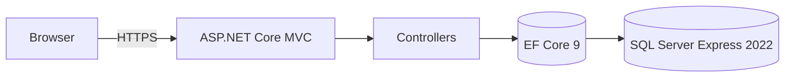

# BlogicCMR · Technická příručka  
> ASP.NET Core MVC • .NET 9.0 • EF Core 9 • SQL Server Express 2022  
> Snapshot ZIP – 4 . 6 . 2025

---

## 1 Architektura



* **Prezentace** – Razor Views + Bootstrap 5 (vlastní téma `#ff5924` / `#513189`)  
* **Obchodní logika** – v controllerech (připraveno pro pozdější služby)  
* **Data access** – `BlogicDbContext`, Code-First Migrations  

---

## 2 Technologie a verze

| Vrstva | Balíček / Image | Verze |
|--------|-----------------|-------|
| .NET SDK | `mcr.microsoft.com/dotnet/sdk` | **9.0** |
| Web framework | `Microsoft.AspNetCore.App` | 9.0 |
| ORM | `Microsoft.EntityFrameworkCore` + `SqlServer` | 9.0.5 |
| DB server | `mcr.microsoft.com/mssql/server` | 2022-latest |
| Kontejnery | Docker Compose | 3.8 |

---

## 3 Struktura řešení

```
BlogicCRM.sln
└─ BlogicCMR/
   ├─ Controllers/         Advisors | Clients | Contracts | Home
   ├─ Models/              Advisor | Client | Contract | ErrorViewModel
   ├─ Data/                BlogicDbContext.cs
   ├─ Migrations/          20250604*_InitialCreate.*
   ├─ Views/               *.cshtml  (CRUD pro všechny entity)
   ├─ wwwroot/             css | js | img
   └─ Program.cs
docker-compose.yml         (SQL Server jediná služba)
```

---

## 4 Doménový model

| Entita | Klíč | Důležitá pole | Relace |
|--------|------|---------------|--------|
| **Client**   | `ClientId`   | FirstName, LastName, Email, Phone, PersonalIdNumber, Age | 1 ⇢ * Contract |
| **Advisor**  | `AdvisorId`  | FirstName, LastName, Email, Phone, PersonalIdNumber, Age | 1 ⇢ * Contract (jako Manager) <br>m ⇢ n Contract (jako Participant) |
| **Contract** | `ContractId` | Institution, DateSigned, DateValidFrom, DateEnd        | FK `ClientId`, FK `ManagerId`, m ⇢ n Advisors |

> Vazbu m:n `Contract ↔ Advisor` materializuje EF Core v tabulce **`ContractParticipants`**.

---

## 5 Lokální spuštění

```bash
# 1 Start SQL Server v Dockeru
docker compose up -d sqlserver    # port 1433

# 2 Vytvoření DB schématu
dotnet ef database update --project BlogicCMR

# 3 Spuštění webové aplikace
dotnet run --project BlogicCMR    # => https://localhost:5001
```

### Důležité proměnné prostředí

| Název | Výchozí hodnota | Popis |
|-------|-----------------|-------|
| `ConnectionStrings__DefaultConnection` | `Server=localhost,1433;Database=BlogicDb;User=sa;Password=YourStrong!Passw0rd;TrustServerCertificate=True` | připojení k SQL |
| `ASPNETCORE_ENVIRONMENT` | `Development` | profil konfigurace |

---

## 6 Docker Compose (výňatek)

```yaml
version: "3.8"

services:
  sqlserver:
    image: mcr.microsoft.com/mssql/server:2022-latest
    environment:
      SA_PASSWORD: "YourStrong!Passw0rd"
      ACCEPT_EULA: "Y"
    ports:
      - "1433:1433"
    volumes:
      - blogiccrm_data:/var/opt/mssql

volumes:
  blogiccrm_data:
```

*Aplikace se spouští lokálně (`dotnet run`).  
